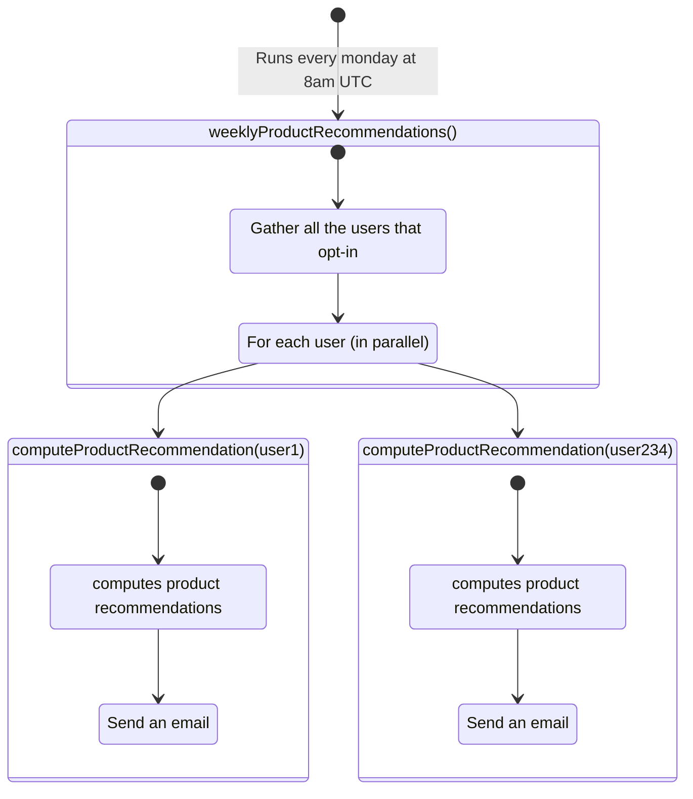

import Image from "next/image";
import { Callout, Tabs, Tab } from "nextra-theme-docs";
import { Prerequisites, Accordion, NextSteps } from "~components";

# Define a Background function as a CRON

Define a CRON from your code and leverage the power of the Defer Platform.

<br />

### Prerequisites

<br />

<Prerequisites
  items={[
    {
      title: "Defer basics",
      subtitle: "Get familiar with background functions",
      icon: "layers",
      link: "/features/background-function",
    },
  ]}
/>

<p>&nbsp;</p>
<p>&nbsp;</p>
<p>&nbsp;</p>

## Overview

A CRON is a background function that is defined using `defer.cron()` instead of `defer()`, as follows:

<br />

```ts filename="defer/weeklyBrief.ts" {7-10} copy
import { defer } from "@defer/client";

const weeklyBrief = async () => {
  // ...
};

export default defer.cron(weeklyBrief, "5 0 * * *");
```

<Callout type="info">CRONs schedule is based on UTC time.</Callout>

<p>&nbsp;</p>
<p>&nbsp;</p>
<p>&nbsp;</p>

## Full example: Weekly recommendations

Defer makes it easy to turn a function into a scheduled (CRON) background function.

In this example, a marketplace wants to send product recommendation to users on a weekly basis.

For this, we will create a scheduled function (`weeklyProductRecommendations()`) that performs the following steps:

1. Gather all the users that opt-in for the weekly product recommendation
2. For each users, in parallel:
   - invoke a background function (`computeProductRecommendation(user)`), that will compute the product recommendations and send an email

<p>&nbsp;</p>
<p>&nbsp;</p>
<p>&nbsp;</p>

### CRON background function

A background function can be configured to run at a given frequency using `defer.cron(fn, frequencyStr)`:

```tsx filename="defer/weeklyProductRecommendations.ts" copy
import { defer } from "@defer/client";

const weeklyProductRecommendations = async () => {
  // ...
};

export default defer.cron(weeklyProductRecommendations, "0 8 * * *");
```

A scheduled background function is similar to a regular background function:

- a scheduled background function **should be async**
- a scheduled background function file **must be named following the function's name** and **export as default**

With some specificities:

- a scheduled background function **should not take arguments**
- a scheduled background function **should not be invoked** directly from your App (will result in errors)

<p>&nbsp;</p>

Let's now see how to implement our product recommendation scheduled function.

<p>&nbsp;</p>
<p>&nbsp;</p>
<p>&nbsp;</p>

### `weeklyProductRecommendations()` scheduled function

<p>&nbsp;</p>

Our weekly product recommendation mechanism is implemented with 2 background functions:

```
- src/
  - defer/
    - weeklyProductRecommendations.ts ⬅
    - computeProductRecommendation.ts ⬅
  - ...
- prisma/
- package.json
- .env
- ...
```

<Tabs items={['defer/weeklyProductRecommendations.ts', 'defer/computeProductRecommendation.ts']}>
  <Tab>
    ```tsx filename="defer/weeklyProductRecommendations.ts" copy
      import { defer } from '@defer/client'
      import computeProductRecommendation from './computeProductRecommendation'

      const weeklyProductRecommendations = async () => {
        const users = await prisma.user.find({
          where: {
            weeklyProductRecommendations: true
          },
        })

        users.forEach(user => computeProductRecommendation(user))
      }

      export default defer.cron(weeklyProductRecommendations, '0 8 * * *')
      ```

  </Tab>
  <Tab>
    ```tsx filename="defer/computeProductRecommendation.ts" copy
      import { defer } from '@defer/client'
      import { User } from '../prisma/generated/client';

      const computeProductRecommendation = async (user: User) => {
        // 1. compute product recommendations ...
        // 2. send email
      }

      export default defer(computeProductRecommendation)
      ```

  </Tab>
</Tabs>

Which translates to the following executions, on each Monday, at 8am:



<p>&nbsp;</p>

By leveraging the Defer background functions, our weekly product recommendation is:

- **Scalable**: by parallelizing the computation and sending of recommendations, the overall time to send the recommendations won't be exponential over time.
- **Reliable**: any error during a product recommendation computing or email sending will trigger a Defer Smart Retry.
- **Observable**: get an overview of the status of the reporting from the Defer dashboard.
- **Monitored**: get notified on Slack if the app couldn't deliver the product recommendation to a user.
