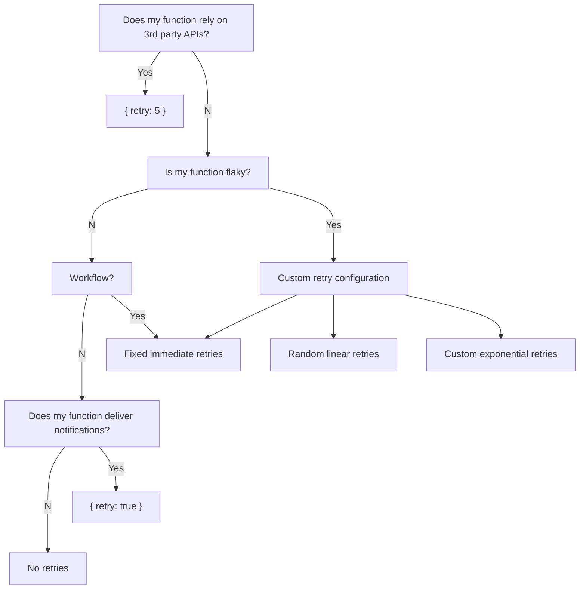
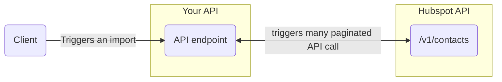

import Image from "next/image";
import { Callout, Tabs, Tab } from "nextra-theme-docs";
import {
  Prerequisites,
  Accordion,
  NextSteps,
  DeferRetrySimulator,
} from "~components";

# Background function Retries

See how to leverage retries to improve your background function's reliability.

<br />

### Prerequisites

<br />

<Prerequisites
  items={[
    {
      title: "Defer basics",
      subtitle: "Get familiar with background functions",
      icon: "layers",
      link: "/features/background-function",
    },
  ]}
/>

<p>&nbsp;</p>
<p>&nbsp;</p>

## Overview

<p>&nbsp;</p>

### When and how to leverage Retries?

Configuring Retries is essential to counter failures linked to external interactions (ex: 3rd party APIs, dependencies, system).

The Retries cheatsheet below is a good starting point:



For more practical examples, please read our ["A deep dive into Function's retry strategies"](https://www.defer.run/blog/function-retry-strategies/) blog post.

<p>&nbsp;</p>

### Configure retries

Retries are configured with `defer()` from `@defer/client`:

```ts
import { defer } from "@defer/client";

async function importContacts(/* ... */) {
  // ...
}

export default defer(importContacts, {
  retry: true,
});
```

Please note that retries are disabled by default.

<br />

Defer offers two ways to configure Retries:

**Retries Shorthands**

`defer()` offers three shorthands configuration for `retries`:

- `{ retries: false }`: Disables retries, equivalent to not passing the `retry` option.
- `{ retries: true }`: Enabled exponential back-off retries with 13 retries, up to 1.3h.
- `{ retries: 5 }`: Enabled exponential back-off retries with 5 retries (any positive number can be passed).

_You can test the shorthands in the Defer Retry playground below._

<br />

**Retries advanced options**

`retry` offers five options to configure your Retries strategy, showcased in the Defer Retry playground below:

<DeferRetrySimulator />

<p>&nbsp;</p>
<p>&nbsp;</p>
<p>&nbsp;</p>

## Full example: Batch contact imports

### Introduction

<p>&nbsp;</p>

Most modern web applications provide rich product integrations that require fetching large amounts of data from third-party APIs.

For example, enabling users to sync their Hubspot contacts with your web application.

While calling the Hubspot API directly from your API's controller would work, it might not for all use cases.

<p>&nbsp;</p>



<p>&nbsp;</p>

Eventually, some users will start importing large sets of contacts, leading to:

- **poor user experience** (your user is waiting for your API response, without any progress indication)
- **global degradation of your API performance** (one of your API's worker process will be unavailable during the whole import)
- **failure to complete the import** (the request to your API did timeout)

<p>&nbsp;</p>

Moving the Hubspot API calls in a background job would provide a better user-experience:

- **resilient product integration**: an unavailable third party API won't impact your API, the background function will retry in case of rate limiting
- **continous feedback to the users**: inform the user of the progress and status of the import

<p>&nbsp;</p>

This example will show you how to implement and run a background function to batch import contacts from the Hubspot API from a web-app built with [Express](https://expressjs.com/).

<p>&nbsp;</p>
<p>&nbsp;</p>
<p>&nbsp;</p>

### The `importContactsFromHubspot()` background function

<p>&nbsp;</p>

As stated in the ["Getting started"](/quickstart) guide, we create our `importContactsFromHubspot()` function in the `defer/` folder:

```
- src/
  - defer/
    - importContactsFromHubspot.ts ⬅
  - api.ts
  - hubspotClient.ts
- package.json
- .env
- ...
```

<p>&nbsp;</p>

Here is our `importContactsFromHubspot()` implementation (_inspired from [Hubspot official Node.js tutorial](https://developers.hubspot.com/docs/api/idea-tracker-tutorial-part-1)_):

<br />

```tsx filename="defer/importContactsFromHubspot.ts" copy
import { hubspotClient } from "../hubspotClient";

const importContactsFromHubspot = async (userId: string) => {
  // ... get hubspot access token from user with Prisma
  const { hubspotAccessToken } = await prisma.user.findUnique({
    where: {
      id: userId,
    },
  });

  hubspotClient.setAccessToken(hubspotAccessToken);
  const getAllContacts = async (offset, startingContacts) => {
    // `console.log()` can be seen from Defer's dashboard
    console.log(`fetching contacts from offset: ${offset}`);

    const pageOfContacts = await hubspotClient.crm.contacts.basicApi.getPage(
      100,
      offset
    );

    const endingContacts = startingContacts.concat(pageOfContacts.body.results);

    if (pageOfContacts.body.paging) {
      return await getAllContacts(
        pageOfContacts.body.paging.next.after,
        endingContacts
      );
    } else {
      return endingContacts;
    }
  };
  const contacts = await getAllContacts(0, []);

  console.log(`fetched ${contacts.length} contacts`);

  // ...inserts contacts in DB...

  return contacts.length;
};
```

The `importContactsFromHubspot()` function fetches all contacts sequentially by batches of 100 contacts.

<p>&nbsp;</p>

Once implemented, we wrap `importContactsFromHubspot()` with `defer()` and export it as `default`:

```tsx filename="defer/importContactsFromHubspot.ts" copy
import { defer } from "@defer/client";
import { hubspotClient } from "../hubspotClient";

const importContactsFromHubspot = async (userId: string) => {
  // ...hubspot contacts API logic...
};

export default defer(importContactsFromHubspot, { retry: 5 });
```

<br />

Moved in a background function, the Hubspot APIs call will not affect your application's performance, and will be retried by Defer in case of failure. Offering a **resilient and responsive user experience**.

The `{ retry: 5 }` is a shorthand for up to 5 exponential back-off retries, as showcased below:


<p>&nbsp;</p>

Our background function is now ready to be called from the API!

<p>&nbsp;</p>
<p>&nbsp;</p>
<p>&nbsp;</p>

### Calling `importContactsFromHubspot()` from the API

<p>&nbsp;</p>

Let's now call our `importContactsFromHubspot()` background function from our API.

<br />

```tsx filename="defer/importContactsFromHubspot.ts" copy
import express from "express";
import importContacts from "./defer/importContacts";

const app = express();

app.post("/hubspot/import", async function (req, res) {
  const userId = req.session.userId;

  await importContacts(userId);

  res.send({ ok: true });
});

app.listen(3000);
```

That's it 🎉

Your application now offers an improved Hubspot contacts integration:

- **great user experience**: the import is performed in the background without impacting your application's overall performance.
- **resilient import**: the import will work for any number of contacts and will resume in case of Hubspot API rate limiting or outage.

This example will be soon updated to showcase how to integrate the progress of a background function in your product to keep the users in the loop (ex: display the status of the Hubspot contacts import in your application).
