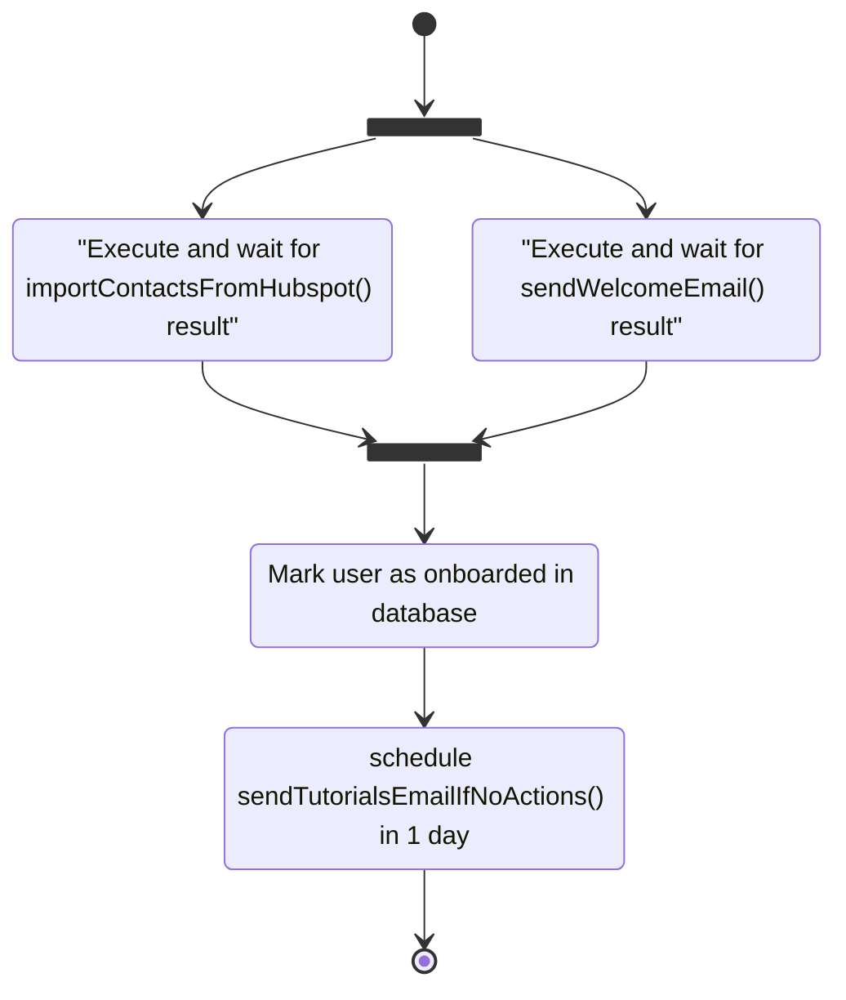

import Image from "next/image";
import { Callout, Tabs, Tab } from "nextra-theme-docs";
import { Prerequisites, Accordion, NextSteps } from "~components";

# Build Workflow with background functions

See how to build asynchronous workflows.

<br />

### Prerequisites

<br />

<Prerequisites
  items={[
    {
      title: "Defer basics",
      subtitle: "Get familiar with background functions",
      icon: "layers",
      link: "/features/background-function",
    },
  ]}
/>

<p>&nbsp;</p>
<p>&nbsp;</p>
<p>&nbsp;</p>

## Overview

Defer allows background functions to call other background functions, making building workflows intuitive.

Build asynchronous Workflows by applying recursion and mapping patterns to background functions, as follows:

<Tabs items={['defer/weeklyProductRecommendations.ts', 'defer/computeProductRecommendation.ts']}>
  <Tab>
    ```tsx filename="defer/weeklyProductRecommendations.ts" {11-13} copy
      import { defer } from '@defer/client'
      import computeProductRecommendation from './computeProductRecommendation'

      const weeklyProductRecommendations = async () => {
        const users = await prisma.user.find({
          where: {
            weeklyProductRecommendations: true
          },
        })

        // computeProductRecommendation() calls will run on the Defer Platform,
        //  in parallel
        users.forEach(user => computeProductRecommendation(user))
      }

      export default defer(weeklyProductRecommendations)
      ```

  </Tab>
  <Tab>
    ```tsx filename="defer/computeProductRecommendation.ts" copy
      import { defer } from '@defer/client'
      import { User } from '../prisma/generated/client';

      const computeProductRecommendation = async (user: User) => {
        // 1. compute product recommendations ...
        // 2. send email
      }

      export default defer(computeProductRecommendation, { concurrency: 10 })
      ```

  </Tab>
</Tabs>

<p>&nbsp;</p>

<Callout type={'info'}>
  **What happen when a workflow fails with retries configured?**

For now, any failure that happen during the workflow will retry the whole workflow from the beginning.

We are planning to add better Control Flow and idempotency APIs in a near future.

</Callout>

<p>&nbsp;</p>
<p>&nbsp;</p>
<p>&nbsp;</p>

## Full example: User onboarding workflow

Application user onboardings tend to compose multiple actions (sending emails) that might spread across multiple steps over time.

For example, when a user onboards, we might want to immediately:

- send a welcome email
- trigger a Hubspot contacts sync

then, make the user as onboarded and, a few days later: send a tutorial if the user is not engaged.

While such workflow can be implemented in a distributed way, in a event-based architecture, or with CRONs, **Defer offers a context-switch free and code-first way to implement such workflows**.

Before jumping into the user onboarding workflow implementation, let's see how Defer enables to run background functions in parallel while waiting for their result, as needed in:

> when a user onboards, we might want to immediately:
>
> - send a welcome email
> - trigger a Hubspot contacts sync
>
> then, make the user as onboarded [...]

<p>&nbsp;</p>
<p>&nbsp;</p>
<p>&nbsp;</p>

### Running background functions in parallel

<p>&nbsp;</p>

Given the following project:

```
- src/
  - defer/
    - importContactsFromHubspot.ts ⬅
    - sendWelcomeEmail.ts ⬅
    - sendTutorialsEmailIfNoActions.ts ⬅
    - userOnboarding.ts ⬅
  - ...
- package.json
- .env
- ...
```

We want to call trigger and wait for the execution of `importContactsFromHubspot()` and `sendWelcomeEmail()`, in parallel.

For this, will use the `awaitResult()` API, as follows:

```tsx filename="src/demo-parallel-runs.ts" copy
import { defer } from "@defer.run/client";
import importContactsFromHubspot from "./defer/importContactsFromHubspot";
import sendWelcomeEmail from "./defer/sendWelcomeEmail";

async function myDemo() {
  const user = {
    /* ... */
  };

  // run the background functions immediately in parallel and wait for the results
  const results = await Promise.allSettled([
    awaitResult(importContactsFromHubspot)(user),
    awaitResult(sendWelcomeEmail)(user),
  ]);
}
```

<br />

If the background function execution succeded, `awaitResult()` will return the value returned by the function.

If it failed, it will raise an error (the one raised by the background function or a generic one.)

<br />

Now that we saw how to run multiple background functions in parallel to get their results, let's see how to write our user onboarding workflow.

<p>&nbsp;</p>
<p>&nbsp;</p>
<p>&nbsp;</p>

### Writing a workflow with Defer

<p>&nbsp;</p>

Writing workflows with Defer is simple, **just call other background functions** from your main background function.

<p>&nbsp;</p>

Our `userOnboarding()` function would call other functions and execute as follow:



As stated earlier, implementing such a workflow is achieved with simple background functions calls:

```tsx copy
import { delay, defer } from "@defer/client";
import sendWelcomeEmail from "./sendWelcomeEmail";
import importContactsFromHubspot from "./importContactsFromHubspot";
import sendTutorialsEmailIfNoActions from "./sendTutorialsEmailIfNoActions";

async function userOnboarding(user: User) {
  await Promise.allSettled([
    awaitResult(importContactsFromHubspot)(user),
    awaitResult(sendWelcomeEmail)(user),
  ]);

  // once the Hubspot data is synced and the welcome mail sent,
  //  let's flagged the user as onboarded
  await prisma.user.update({
    where: { id: user.id },
    data: { onboarded: true },
  });

  const sendTutorialsEmailIfNoActionsDelayed = delay(
    sendTutorialsEmailIfNoActions,
    "1 day"
  );
  await sendTutorialsEmailIfNoActionsDelayed(user);
}

export default defer(userOnboarding);
```

Congrats, you implemented your first workflow with Defer 🎉

You can start this workflow from your application's API like any background function: `userOnboarding(user)`.

Your workflow will benefit of all Defer's features:

- Analytics and logs on Defer dashboard
- Smart retries on child background failures
- Slack notification on workflow failures
- Cancel and re-run workflow from the Defer dashboard
