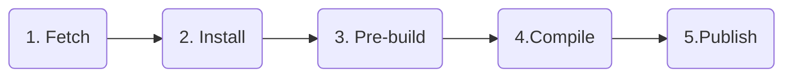

import Image from "next/image";
import { Callout, Tabs, Tab } from "nextra-theme-docs";
import { Accordion, NextSteps } from "~components";

# Builds

How the Defer Platform compiles your background functions.

 

The Defer Platform locates an application's background functions ([How
Defer works](/platform/how-defer-works)) to:

- extract metadata (configuration of retries, concurrency, type of the
  function - CRON or not)
- bundle it with its imports for later
  [Executions](/platform/executions)

This page describes all the configurations linked to Defer Builds.

 
 

## Background functions requirements

In order to compile your background functions, the builder detects the files inside you `/defer` folder.

Here are the requirements for those files:

- `(js|jsx|ts|tsx|cjs|cjsx|cts|ctsx|mjs|mjsx|mts|mtsx)` extensions are supported
- `*.spec.*`, `*.test.*`, `*_spec.*`, `*_test.*` files are ignored
- `spec`, `test`, `specs`, `tests` nested folders are ignored

 
 

## Configuration and defaults

|                        | Default | Description                                                                                                          |
| ---------------------- | ------- | -------------------------------------------------------------------------------------------------------------------- |
| **Project root**       | `/`     | This path is used to locate the `tsconfig.json`                                                                      |
| **Package Manager**    | `npm`   | We automatically detect your package manager. We currently support NPM and Yarn. PNPM support is coming soon.        |
| **Pre-build** command  | None    | This command is your own, e.g., generate Prisma type or any other task that must be done before running compilation. |
| **Node Version**       | `18`    | We currently only support LTS node version (16, 18 or 20).                                                           |
| **TypeScript version** | -       | Our Build pipeline uses the typescript version installed in your project. We support TypeScript in all 4.x versions. |

 
 

## Build lifecycle

Each new commit or update of an application's setting triggers a new
build.

**Each build is processed sequentially;** we do not support
auto-cancel builds yet.

 

### 1. Fetch

We fetch your project from GitHub with the environment configured
branch.

<Callout type="info">
  **Limitations**: We currently don't support Git Submodules. Please reach us if
  you need to use them.
</Callout>

 

### 2. Install

We install your project dependencies using the detected package
manager. Dependencies are **installed with the exact versions found in
the lockfile** (no update).

**Native dependencies are supported** (ex: Prisma), as long as they
work on Ubuntu.

<Callout type="info">
  **Limitations**: We currently don't support private packages.
</Callout>

 

### 3. Pre-build

A pre-build command can be configured for generated TypeScript types,
ex: Prisma or GraphQL Code Generator.

 

### 4. Compile

We compile your background functions using the TypeScript Compiler
API, **supporting all TSConfig options, custom `paths` included**.

We support the latest and upcoming TypeScript major versions (4.x, 5);
however, **we recommend your project to stay up to date with the
latest stable version**.

 

### 5. Publish

Once your background functions compiled and bundled, we archive them
and store them, encrypted at rest.

 

Any build error will result in a notification - if configured
([Alerting](/platform/alerting)).

 

<Callout type="info">
  **A build can take up to 30 minutes**. After 30 minutes, the build timeout and
  result in a failed build. Contact us to extend the allowed build time if your
  project takes more than 30 minutes.
</Callout>

 
 

## Reserved Environment variables

The following Environment variables are reserved and will be overrided if configured on the environment's settings.

- `DEFER_TOKEN`
- `NODE_ENV`
- `FORCE_COLOR`
- `NODE_DEBUG`
- `NODE_DEBUG_NATIVE`
- `NODE_DISABLE_COLORS`
- `NODE_EXTRA_CA_CERTS`
- `NODE_ICU_DATA`
- `NODE_NO_WARNINGS`
- `NODE_OPTIONS`
- `NODE_PATH`
- `NODE_PENDING_DEPRECATION`
- `NODE_PENDING_PIPE_INSTANCES`
- `NODE_PRESERVE_SYMLINKS`
- `NODE_REDIRECT_WARNINGS`
- `NODE_REPL_HISTORY`
- `NODE_REPL_EXTERNAL_MODULE`
- `NODE_SKIP_PLATFORM_CHECK`
- `NODE_TLS_REJECT_UNAUTHORIZED`
- `NODE_V8_COVERAGE`
- `NO_COLOR`
- `OPENSSL_CONF`
- `SSL_CERT_DIR`
- `SSL_CERT_FILE`
- `UV_THREADPOOL_SIZE`

<Callout type={"info"}>`NODE_ENV` value is ignored during build.</Callout>

 
 

## FAQ

<Accordion title={"What happens when a build fails?"}>
  A build failure triggers a notification on your Slack - if configured, and a
  notification on our side, so we can better assist you. If a Scheduled Function
  (CRON) was already defined in your project, a build failure wouldn't stop or
  update its schedule.
</Accordion>
<Accordion title={"How long do you keep the history of builds?"}>
  The build logs' retention is 7/30/90 days, depending on your plan. Refer to
  the [Limits](/platform/limits) for more details.
</Accordion>
<Accordion title={"Is there a limit to a build's log size?"}>
  The size of a build's logs is limited to 200/1000/10000 Mo, depending on your
  plan. Refer to the [Limits](/platform/limits) for more details.
</Accordion>
<Accordion title={"Is there a limit to the build duration?"}>
  The duration of builds is limited to 30/60/600 min, depending on your plan.
  Refer to the [Limits](/platform/limits) for more details.
</Accordion>
<Accordion title={"Do you keep a copy of my project's code?"}>
  Our Build System temporarily downloads your code from GitHub, installs the
  dependencies, compiles and bundles your background functions, and stores them,
  encrypted at rest on our private servers (not accessible from the web). Only
  the code used in your background functions ends up being stored - for a
  limited time ([Limits](/platform/limits)) - on our servers.
</Accordion>
