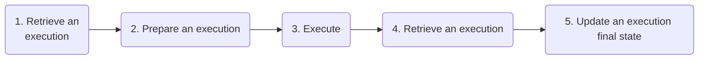

import Image from "next/image";
import { Callout, Tabs, Tab } from "nextra-theme-docs";
import { Accordion, NextSteps } from "~components";

# Executions

A background function call from your application triggers a run on the
Defer Platform: an execution.

This page covers the lifecycle of an execution and the associated
configurations.

&nbsp;

&nbsp;

&nbsp;

## Configuration and defaults

Please refer to [Limits](/platform/limits) for information regarding
maximum durations or other limitations.

|             | Default | Possible values               | Description                                                        |
| ----------- | ------- | ----------------------------- | ------------------------------------------------------------------ |
| concurrency | `1`     | Hobby: `1`   Pro: `1-10` | Specify in the background function should benefit from parallelism |
| retries     | `0`     | `0-15`                        | Specify how many times a failed execution should be retried        |

&nbsp;

&nbsp;

&nbsp;

## Error handling

 

Any error outside of a background function execution (steps 1, 2, 4, 5) would update the execution to “Failed”, without retry. In such an
event, you will be notified on Slack and will be able to rerun it from
the Console.

**Out of memory behavior**

A background function execution reaching the [memory
limit](/platform/limits) will be stop as failed, without retry.

&nbsp;

&nbsp;

## Concurrency

**Eventually FIFO**

A background function, when configured as FIFO (`concurrency: 1`),
will be process executions one by one. However, please note that our
Scheduler - at the moment - is eventually FIFO, doing best effort to
respect the queueing order.

&nbsp;

**Concurrency account limits**

Each account gets a maximum concurrency [(Hobby: 2, Pro: 10)](/platform/limits) that take precedence on the configured
background functions concurrency.

For example, on a Pro Plan, if 2 background functions with
`concurrency: 10` triggers 100 executions each, the Defer Platform
will takes 5 of each concurrently, matching the account maximum
concurrency (`10`).

&nbsp;

&nbsp;

## Retries

When configured, Defer applies an [exponential
backoff](https://en.wikipedia.org/wiki/Exponential_backoff) (with
random jitter) retry algorithm to a failed execution:

|                    | _Execution time_ | _1st retry time_       | _2nd retry time_       | _3rd retry time_        |
| ------------------ | ---------------- | ---------------------- | ---------------------- | ----------------------- |
| `importContacts()` | _t1_             | _t2 = t1 + (16 - 36s)_ | _t3 = t2 + (31 - 61s)_ | _t4 = t3 + (96 - 136s)_ |

This approach ensures that retries are distributed and works well for
rate-limited executions.

&nbsp;

&nbsp;

## Execution result

The value returned by a background function should be a non-null value
(`void` is permitted).

Please note that the execution result (return value) has a [maximum
size limit](/platform/limits) and **must be serializable**.

&nbsp;

&nbsp;

## Date and time

Background functions are executed with a `UTC` timezone configuration.

**Please take it in consideration when writing date/time-related logic
in your background functions.**

&nbsp;

&nbsp;

&nbsp;

## Reserved Environment variables

The following Environment variables are reserved and will be overridden
if configured on the environment's settings.

- `DEFER_TOKEN`
- `FORCE_COLOR`
- `NODE_DEBUG`
- `NODE_DEBUG_NATIVE`
- `NODE_DISABLE_COLORS`
- `NODE_EXTRA_CA_CERTS`
- `NODE_ICU_DATA`
- `NODE_NO_WARNINGS`
- `NODE_OPTIONS`
- `NODE_PATH`
- `NODE_PENDING_DEPRECATION`
- `NODE_PENDING_PIPE_INSTANCES`
- `NODE_PRESERVE_SYMLINKS`
- `NODE_REDIRECT_WARNINGS`
- `NODE_REPL_HISTORY`
- `NODE_REPL_EXTERNAL_MODULE`
- `NODE_SKIP_PLATFORM_CHECK`
- `NODE_TLS_REJECT_UNAUTHORIZED`
- `NODE_V8_COVERAGE`
- `NO_COLOR`
- `OPENSSL_CONF`
- `SSL_CERT_DIR`
- `SSL_CERT_FILE`
- `UV_THREADPOOL_SIZE`

&nbsp;

&nbsp;

&nbsp;

## FAQ

<Accordion title={"How Defer ensures never loses an execution?"}>
  All queued executions are stored on disk storage - not in memory - and
  replicated across multiple A/Z for better reliability.
</Accordion>
<Accordion title={"Is an execution secure?"}>
  Each execution happens in an isolated container with an allocated VPC and
  storage. It is not possible to communicate between executions, and each
  background function source is fetched securely.
</Accordion>
<Accordion title={"How do you guarantee executions will be processed on time?"}>
  Each function belongs to a dedicated scheduling queue, preventing abuse from a
  specific user. Also, our infrastructure auto-scales to ensure a reasonable
  processing time (see [Limits](/platform/limits)).
</Accordion>
<Accordion title={"How is a Defer execution different from an AWS Lambda one?"}>
  A Defer execution runs in a container, enabling long-running jobs (>15min)
  without limitations on native dependencies.
</Accordion>
<Accordion title={"Can my background function access the file system?"}>
  Yes; however, execution storage is temporary and gets removed after the
  execution ends. Also, please refer to [Limits](/platform/limits) for storage
  limitations.
</Accordion>
<Accordion title={"Do Executions have a cold start delay?"}>
  Expect a cold start ranging from 1 to 3 seconds, depending on the number of
  dependencies of your project and the size of your bundled background function
  (with its import).
</Accordion>
