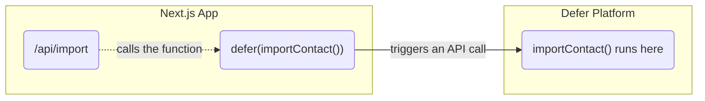

import Image from "next/image";
import { Callout, Tabs, Tab } from "nextra-theme-docs";
import { Accordion, NextSteps } from "~components";

# How Defer works

Defer is a zero-infrastructure Node.js background jobs platform.

Defer build your project from GitHub and execute your background functions on its infrastructure.

<p>&nbsp;</p>

Take the following Next.js project:

```
- defer/
	- importContacts.ts
- pages/
	- api/
		- import.ts
- styles/
- .env.example
- package.json
- tsconfig.json
```

As soon as a commit is pushed on your application, Defer will get the up-to-date source code of the corresponding Git Branch and compile the background functions from the `defer/` folder (more information in “Builds”).

When your API calls a background function, as follows:

<br />

```tsx filename="pages/api/import.ts" {2, 13} copy
import type { NextApiRequest, NextApiResponse } from "next";
import importContacts from "../../defer/importContacts";

type Data = {
  ok: boolean;
};

export default async function handler(
  req: NextApiRequest,
  res: NextApiResponse<Data>
) {
  await importContacts([]);

  res.status(200).json({ ok: true });
}
```

The call to the `importContacts()` function is actually replaced with a call to Defer's API to trigger an execution of `importContacts()` on Defer's Platform:

<br />



<br />

For more information on how background functions get executed, please see [“Executions”](/platform/executions).

<p>&nbsp;</p>
<p>&nbsp;</p>

## FAQ

<Accordion title={"What happens to my background functions locally?"}>
  Your background functions run asynchronously in dev mode; more details on the
  [Local development page](/features/local-development/).
</Accordion>
<Accordion title={"Can my background function calls get lost?"}>
  No, the `@defer/client` apply a round-robin retry mechanism when contacting
  the Defer API. Once received, the Defer jobs get persisted to disk.
</Accordion>
<Accordion title={"What happens if Defer fails to build a commit?"}>
  You will be notified immediately, and your background functions will continue
  running on the last successful build.
</Accordion>
<Accordion title={"What happens when a background job execution fails?"}>
  Unless configured, execution does not get retried by default. For more
  information on the execution's lifecycle, please refer to
  [“Executions”](/platform/executions).
</Accordion>
